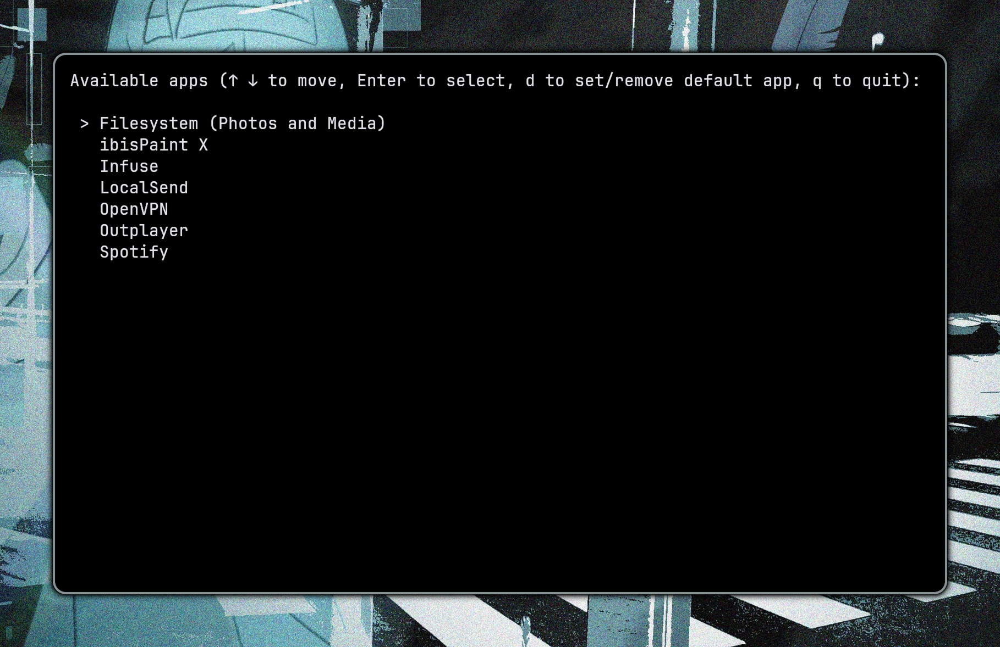

<p align="center">
  <a href="https://github.com/alvaniss/mc-check"></a>
  <a href="https://github.com/alvaniss/mc-check"></a>
  <a href="https://github.com/alvaniss/mc-check"></a>
</p>

# iMount
  
Script that allows to mount iOS devices on Linux to manage their files, built around ifuse.



## Features

- **Default Apps:** Choose a defalt app to mount to instantly when you run the script.
- **Auto File Managing:** Script will automatically create the mount folder when app is mounted and remove it when it's unmounted.
- **Auto Open Folder:** Script will open the mount folder with your file manager (using xdg-open).
- **Fully Interactive:** Easy to use, has common keybinds for a CLI app.
- **Mount Both Filesystems:** Script allows mounting both a general device filesystem and a specific app one.

## Defaults

When first ran, script won't have a default app chosen, but you can add one by pressing [d] while the app list is open. Doing so will add `default-app` file to `~/.config/imount/`.

## Dependencies

1. `bash`
2. `ifuse`
3. `xdg-utils`

## Installation

### Arch Linux

Install from AUR with your helper of choice (example uses `yay`):

```shell
yay -S imount
```

### Manual

```shell
git clone https://github.com/alvaniss/imount
cd ./imount/
sudo make install
```

## Usage

```shell
imount
```

## Notes

- This fork improves on the original script by essentially rewriting the whole thing and adding new features as well as just making general impromements in user experience.

## Credit

Script is essentially built upon libimobiledevice, specifically around [ifuse](https://libimobiledevice.org/).

## License

This project is open source. See the LICENSE file for details
